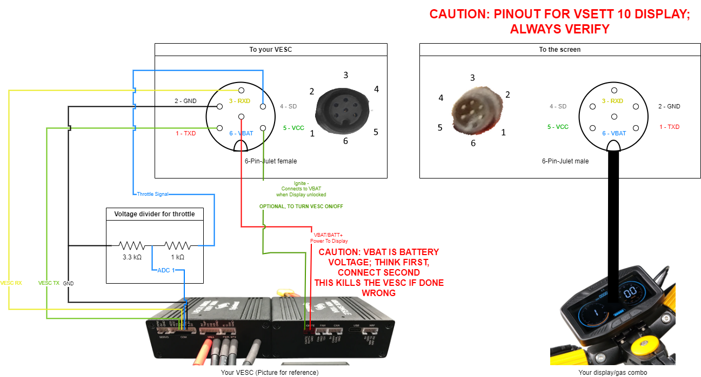

## Installation/Configuration

I assume, that if you install VESC, you are fairly comfortable with making decisions and weighting your options. I am not going to make them for you.


## The general connection schemactic:




## Step-by-step instructions:

### Step 1: BOM

You will need:  
1. 6-pin female Julet connector, >800mm length
2. 1kΩ Resistor, any size, any form for resistor divider
3. 3kΩ Resistor, any size, any form for resistor divider
4. Some way to connect to your VESC. Mine have PH2.0 connectors, so I have connectors for crimping, and build connections as I need. A premade harness which you cut and solder to is also absolutely ok.
5. A piece of any breadboard


### Step 2: Lay the cable (or not)

You have to decide between two options - 
Laying the cable from top to bottom through the stem without anything attached is easier, than from bottom to top with the higo connector in front of it.  

On the other side, working on the cable end is harder when it is already in the scooter.  Try routing  the cable from the bottom, an decide, if you will be able to repeat that feat with everything attached on the vesc side. 

If you think, that bottom-to-top routing is doable, skip this step.

### Step 3: Build the divider

Why - Kugoo display/throttles have 4v max output. That is too much for your adc on your stm. You want to have about 3.3v at max, and have a kill switch for everything above that. 

If you know how it is done, you know how it is done.

If you don't, here is my suggestion how to tackle it (ignore resistor colors, I took the first I found for the demonstation)


1. Take your breadboard, solder two resistors in, connect the THR from the Julet connector and GND and ADC1 connection from your VESC. If you want, you can also connect the GND for the display on the same breadboard, if you don't want to use it from a connector.
2. Clean the board from flux, cut off (I use a sidecutter for that) unneeded bits, cross wires so that you have a place to ziptie them to
3. Add heatshrink and a ziptie to fix the wires to the PCB.

You can do the same without a breadboard, but I advise you against that.
The breadboard has following advantages:
1. You do not rely on the resistors mechanical strength
2. Your soldering is not under constant mechanical stress, and so vibrations don't matter
3. You can easily mount it anywhere in any form
4. You can use smd resistors, if you have them

### Step 4: Connect everything

Now you should connect everything, and see if everything works.
Stuff working should be:
1. The display turns on 
2. The display turn on your vesc, if you have ignition connected to vcc of display
3. You can see throttle input in the ADC. Don't forget to enable RT App in the configurator

### Step 5: Upload the script to your vesc

1. **Make sure you are using 6.05 firmware**
2. Open the configurator
3. Make sure magnets and wheel diameter are set the same/correctly for all VESCs. Otherwise  bad thig
4. Click on VESC Dev tools
5. Click on the LISP tab
6. Copy the contents of [the script](vsett_display_dual_vesc.lisp) to the window
7. Adjust the parameters to your desired values - see parameter description below
8. Click on upload (don't forget, you should be uploading to the vesc the display is connected to)
9. Error 10 should disappear, everything should be working

Following parameters are available right now:
1. The profiles  
First number is max-speed in km/h, second number is motor current.
These numbers are applied to all vescs listed in the slaves list
```
(define profile_1 (list 10 20))
(define profile_2 (list 15 30))
(define profile_3 (list 22 40))
(define profile_S2 (list 100 30))
(define profile_S3 (list 100 90))
```


2. The list of slave-escs  
Here you should write the number you see in the lower left corner in the configurator.  If you have more than 2 motors, you can add those here.
```
(define can_slave_id_list (list 61))
```


3. P-Values  
The display uses some magic formula for speed calculation. 
The script needs the P-Values of tire diameter and magnets set in the display.
```
(define p06 10)
(define p07 30)
```

4. Hidden modes switch  
This is the sequence of gears, which needs to be entered before enabling lights, to unlock hidden modes. A couple of limitations:  
    1.It has to be 7 items long  
    2. You can not have same numbers following eachother, obviously  

It works like this:
1. You switch gears, in the order you entered in the script. Don't do it too fast - it does not register otherwise. About 2 switches per second are okay.
2. You enable the lights, by holding the + button.
3. The display blinks the (!) to let you know, that the sequence was accepted.
4. Your gears 2 and 3 now use the parameters from profile_S2 and profile_S3 correspondingly. 
5. Switching to gear 1 returns you to the usual profile 1-3.

 
### Step 6: Make sure everything works as expected

Basically you should be set to go, but make sure that the gears work as you expect them to, and change the max erpm on every esc.

If you think something is missing from the guide, let me know.