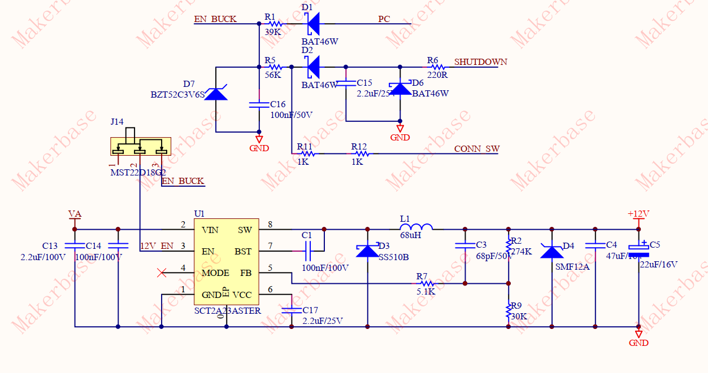

# Installation/Configuration

I assume, that if you install VESC, you are fairly comfortable with making decisions and weighting your options. I am not going to make them for you.

**I recommend reading the whole thing before starting, so that you won't do unnecessary work.**

## 1. Display pinout

### Display


This is the pinout of the display on the VSETT10. THe QS-S4 _should_ be the same, but I did not check.
The names come from how they are labeled on stock controllers. Here is what they mean:

1. RXD - Receiver part of the UART. The display expects data from the ESC here.
2. GND
3. TXD - Sender part of the UART. The display sends data to the ESC here.
4. SD - Throttle signal. This varies between about 0.9 and 4 volts.
5. VCC - "Ignite" - when the display is enabled and unlocked, battery voltage gets sent back here.
6. VBAT - Power for the display

### ESC


This is the connector which will go to your ESC. **Don't forget, the pins will be mirrored, and RX connects to TX!** Also, don't trust your cable colors. There is no uniform color standard, so cable colors can vary. Check with a multimeter, before connecting to your ESC.

1. TXD - Sender part of the UART. The esc will send data to the display here.
2. GND
3. RXD - Receiver part of the UART. The display expects data from the ESC here.
4. SD - Throttle signal. Don't forget - **DONT CONNECT DIRECTLY - THE STM32 HANDLES UP TO 3.3V, not up to 4V**
5. VCC/Ignite - can be connected to enable/disable your ESC
6. VBAT - Should be connected to VBAT, to supply power to display.

## 2. Connecting

### 1. BOM

Materials that you will need will vary depending on what you are connecting to the display.
Some stuff will be needed, no matter the details:

1. 6-pin female Julet connector, >800mm length. I have resorted to using 2 extensions cables - 1 for the stem, another cut in half to connect to the VESC.
2. Connectors/wires/soldering stuff to somehow connect to your VESC. I have connectors for crimping, and build connections as I need. A premade harness which you cut and solder to is also absolutely ok. Sometimes sondering will be inevidable, depending on connector sizes - some wires may be too thick/thin for direct connections.
3. Most likely some resistors. Read further, to know what you will really need. 

### 2. Connect UART, GND, VBAT - Easy

This is as easy as it sounds - power to the display, UART RX/TX and GND can be connected directly on all VESCs I have seen on the market so far.

### 3. Connecting throttle - Medium

If you read the pinout part, you know, that the throttle signal sent by the display is higher, than the microcontroller on the vesc can handle. So now you have two options:

#### 1. Option 1 - direct connection

If you like me don't have any additional hardware attached, you will need a [divider](https://ohmslawcalculator.com/voltage-divider-calculator), which will reduce the voltage range, that comes from the throttle.

If you know how it is done, you know how it is done.
If you don't, here is my suggestion how to tackle it (ignore resistor colors, I took the first I found for the demonstation):

1. You should propably keep the lower arm below 10k, to not mess with impedance on the input.
2. Any combo that gives you the desired 3.3v max from 4v is  absolutely ok - you could use 10k on the lower arm, and 2,2k on the upper arm - you could also use 3.3k/1k. Just make sure you are below 3.3V, and above 3V, to not loose too much resolution.


1. Take your breadboard, solder two resistors in, connect the THR from the Julet connector and GND and ADC1 connection from your VESC. If you want, you can also connect the GND for the display on the same breadboard, if you don't want to use it from a connector.
2. Clean the board from flux, cut off (I use a sidecutter for that) unneeded bits, cross wires so that you have a place to ziptie them to
3. Add heatshrink and a ziptie to fix the wires to the PCB.

You can do the same without a breadboard, but I advise you against that.
The breadboard has following advantages:

1. You do not rely on the resistors mechanical strength
2. Your soldering is not under constant mechanical stress, and so vibrations don't matter
3. You can easily mount it anywhere in any form
4. You can use smd resistors, if you have them

#### 2. Option 2 - "adc board"

I don't use them, but I know they exist - boards with extension ports, which allow to connect 5v throttle/brake sensors, and have a built-in divider, which can be adjusted. It works in exactly the same way, as the method described above. I have no idea on the other ramifications, how and what it does, research it yourself, if you need it. 

### 4. Connecting "ignite" - Easy to hard

The stock controller on the VSETT handles the turning on/off in an industry-standart fashion - the dcdc stepwown, which powers the logic of the esc, gets enabled or disabled, while the power stage on the ESC remains connected to the energy source. While the implementation varies slightly between manufacturers, it remains the same for ninebot, xiaomi and all other scooters.
Sadly, so far Benjamin has not been focusing on escoots, so his ideas on how vesc should be turned on/off have been slightly different, and the chinese manufacturers all handle it slightly different one to the other, from very good to very bad implementations. You will be dealing with one of those implementations:

#### 1. Easiest to connect, best implementation of power on/off - ESC with an "ignite" port


While in general, the VESC in the picture (in my opinion) is shit, the presence of an "ignite" port makes it a breeze to connect. It operates on the same assumption, as the stock esc and other common escs on the market - apply VBAT to ignite, to turn on the logic stage, remove it to disable the logic stage. Just wire everything up with the divider to take care of the throttle, and you are good:


#### 2. Not too bad to connect, no implementation of power on/off - ESC without any enable/"ignite" ports


Some VESCs, nowadays "older" ones, like the 75100 alu, or the 75100 brick (both are shit as well, in my opinion), don't have any way to enable/disable them natively. This is not as bad as it may seem. They still are structured the same, where there is a dcdc stepdown powering the logic part, which can be disabled. All the recent chinese designs _I have seen_ use the **SCT SCT2A23ASTER** stepdown. It has an EN leg, which controls its behaviour:

- Float or connect to VIN to enable the converter.
- Pull below 1.23V to disable the converter.

What that means for us, is that we want the EN leg pulled to ground at all times, except for when the display is on/unlocked. The minimum needed setup would be a single resistor to gnd, but this causes issues with huge drain current, so the most elegant solution is a divider. This time though, you **will have to calculate it on your own**.


The EN leg has to be pulled down with a fairly small resistor, 10k or less. This means you have to calculate the upper arm of the resistor according to your battery voltage, so that the voltage on the EN leg remains over 1.2 (preferably a bit more, so that it does not turn off on a dip). It sounds complicated, but I assure you, it is not.

Assuming that you stick for the 10k lower arm:
**Attention** - if you connect multiple a23a in parallel this way (you have a dual drive escoot), 10k may be too much. If your escs don't reliably turn off, when the screen turns off, you may want to go with a lower resistor, for example a 5k, which I do for my dual-drives. Adjust the calculations accordingly.

1. Check when your bms cuts off your battery. This is the voltage, until which you propably want to keep the vesc enabled either way. The cutoff is propably at 3v or similar per cell. For a 14s battery, that would mean, that the lowest voltage you can get, would be 14s * 3v = 42v. Let's say you have a cutoff at 3.3v per cell, and a 20s battery. That would in turn mean that the lowest you go is 20s * 3.3v = 66v. You can calculate that easily for any cutoff and voltage you wish for. 
2. Now that we know, that the lowest voltage we will get from the screen to the VCC will be around 42v in our first example, we go back to the [divider calculator](https://ohmslawcalculator.com/voltage-divider-calculator), and enter the values accordingly: _R2_ is 10kOhm, our desired _output voltage_ is above 1.23v - let's take a safety margin, and go with 3v, just to be sure it won't dip lower on a battery sag, our _source voltage_ is 42v. The result is 130kOhm.
3. Most likely, you won't have a resistor of the precise value that you calculated, and that's quite alright. We have a very large range to work with, as long as we stay above 2v for our EN leg, on the lowest battery voltage you are comfortable with. Play around in the divider calculator with resistors that you have, and aim for the "above 1.2v" target.
4. (Bonus) You may ask at this point, "why do I even need a divider, if the EN leg can handle Vbat? Can't I just attach VCC to it, and a resistor to ground? The answer is yes and no. The problem arises with the power flowing from vcc through the resistor, directly to ground. If you read until here, you propably are comfortable with basic math, so consider this - we only keep the 10kOhm resistor to gnd, and apply VCC directly. 
According to Ohms Law, to get the current we divide our voltage (on our 14s example battery, fully charged that would be 14s * 4.2v = 58.8v) by our resistance (10kOhm resistor), and get the current. 58.8v / 10 000 Ohm=0.00588A, or 5.88mA. Power, as you know, is calculated P = I * V, or in our case, 58.8v * 0.00588A = 0,345744W(!). That's quite a lot of heat to dissipate and power consumed for simply having your esc turned on.
You can't really go higher than 10k, because it limits the current too much, so that the EN pin is never fully pulled to the ground. That's why we build the divider. Since the divider from the VCC perspective is two resistors in series, and almost nothing flows to the EN pin, we can calculate the total current over R1 + R2. Let's say we picked 100k for R1. 58.8v / (100 000Ohm + 10 000Ohm) = 0.000534A, or 0.534mA. That's only 0.03W to waste and dissipate, which is way nicer.

The end result should look somewhat like this:


And the general schematic somewhat like this:


#### 3. Not-so-fun to connect, floating + vesc reference implementation for power on/off - ESC with conn_sw


Recent vescs related to 84100 and 84200 have started adopting the reference design from Benjamin, with a couple of cargocult-like moments. While the gesture is appreciated - out of the box turning off, and all that, for most escoot purposes it is nightmarish to work with at best. I have only looked at the 84100 so far, so I can not judge, if the pcb layout will be the same for other versions. To connect this one properly, you have to understand, how this "keep enable/shutdown" works.
This is what the implementation on the 84100 and 84200 of makerbase looks like:



If you are interested in the placement on the pcb, I have retraced it [here](img/pcb_layout.png)

It looks way scarier than it is. We still have the a23a with the EN leg. If the switch is flipped to the right, the EN leg is connected to the close-enough-to-reference-implementation from Benjamin, which is useless for us. It works in reverse, by being constantly on, and using short-term button presses to gnd to turn off, and turn on on wheel movement. No idea what it was made for, propably those longboards?

But dont fret! **If the switch is to the left, you guessed it, the EN is floating as usual!** That means you can simply follow the process outlined before, with calculating a divider. The only difference - **you solder not to the leg directly, but to the "always on" part of the switch** After you have calculated everything, simply solder a wire to the floating part of the switch, and flip it to the left. You can now at will switch to the "normal" mode of operations, when needed, and have everything turn on/off via this one new cable. 

Sadly, this time, there is no nice space to place the resistors. For my projects I usually run 2 escs, so I decided to simply place both dividers (one for the throttle, another for the enable) on a separate pcb I connect the screen to.
Ignore the size, I simply have a "standard" breadboard holder for my experiments. You really only need a very small piece.


### Step 5: Check your pinouts

At this point you should be ready to roll. Make sure that all your pins are going to where you intend them to go. Make sure that your vbat is not shortcircuiting somewhere you don't want it to shortcircuit. Make sure the resistors you used for the dividers are really what they said on the box. Make sure your cabling is a-ok. 

### Step 6: Power on from a controlled power source

Ideally you should have a bench power supply, where you can limit the current. If not, put your bms protection to absurdly low values, something under 1A, and power on. If magic smoke has not exited your escs, then everything should be good, and you can proceed with the next steps.

### Step 7: Power on via the display

Stuff working should be:

1. The display turns on
2. The display turn on your vesc, if you have ignition connected to vcc of display
3. You can see throttle input in the ADC. Don't forget to enable RT App in the configurator

### Step 8: Upload the script to your vesc

1. **Make sure you are using 6.05 firmware**
2. Open the configurator
3. Make sure magnets and wheel diameter are set the same/correctly for all VESCs. Otherwise  bad thig
4. Click on VESC Dev tools
5. Click on the LISP tab
6. Copy the contents of [the script](vsett_display_dual_vesc.lisp) to the window
7. Adjust the parameters to your desired values - see parameter description below
8. Click on upload (don't forget, you should be uploading to the vesc the display is connected to)
9. Error 10 should disappear, everything should be working

Following parameters are available right now:

1. The profiles

    First number is max-speed in km/h, second number is motor current.
    These numbers are applied to all vescs listed in the slaves list

    ```lisp
    (define profile_1 (list 10 20))
    (define profile_2 (list 15 30))
    (define profile_3 (list 22 40))
    (define profile_S2 (list 100 30))
    (define profile_S3 (list 100 90))
    ```

2. The list of slave-escs

    Here you should write the number you see in the lower left corner in the configurator.  If you have more than 2 motors, you can add those here.

    ```lisp
    (define can_slave_id_list (list 61))
    ```

3. P-Values  
    The display uses some magic formula for speed calculation.
    The script needs the P-Values of tire diameter and magnets set in the display.

    ```lisp
    (define p06 10)
    (define p07 30)
    ```

4. Hidden modes switch  
This is the sequence of gears, which needs to be entered before enabling lights, to unlock hidden modes. A couple of limitations:  
    1.It has to be 7 items long  
    2. You can not have same numbers following eachother, obviously  

It works like this:

1. You switch gears, in the order you entered in the script. Don't do it too fast - it does not register otherwise. About 2 switches per second are okay.
2. You enable the lights, by holding the + button.
3. The display blinks the (!) to let you know, that the sequence was accepted.
4. Your gears 2 and 3 now use the parameters from profile_S2 and profile_S3 correspondingly.
5. Switching to gear 1 returns you to the usual profile 1-3.

### Step 9: Make sure everything works as expected

Basically you should be set to go, but make sure that the gears work as you expect them to, and change the max erpm on every esc.

If you think something is missing from the guide, let me know.
